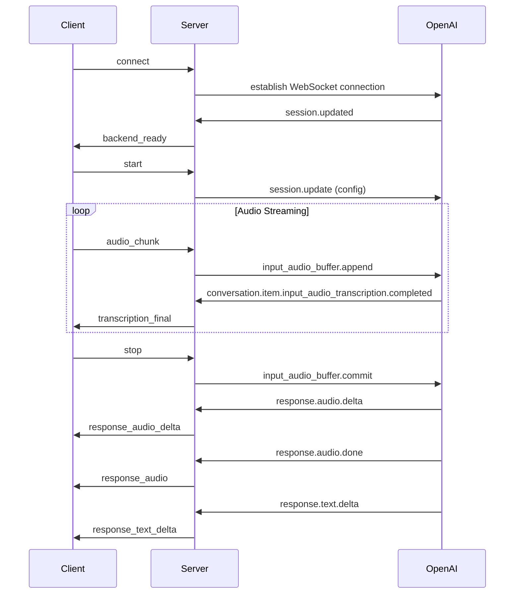

# 🎤 Audio Streaming Server

A real-time audio streaming server that integrates with OpenAI's Realtime API for transcription and generation of audio and text responses.


## 📋 Table of Contents

- [Overview](#-overview)
- [Technologies Used](#-technologies-used)
- [Prerequisites](#-prerequisites)
- [Installation](#-installation)
- [Configuration](#-configuration)
- [How to Use](#-how-to-use)
- [Architecture](#-architecture)
- [WebSocket Events](#-websocket-events)
- [OpenAI API](#-openai-api)
- [Development](#-development)
- [Project Structure](#-project-structure)

### Main Dependencies

- **@fastify/cors** - CORS support for Fastify
- **fastify** - Fast and efficient web framework
- **socket.io** - WebSocket library for real-time communication
- **ws** - WebSocket client for OpenAI Realtime API connection

### Development Dependencies

- **@biomejs/biome** - Fast linter and formatter
- **@types/ws** - TypeScript definitions for ws
- **ultracite** - Biome configuration preset

## 🎯 Overview

This project is a backend server that provides real-time audio streaming capabilities, using WebSockets for bidirectional communication with clients. The server acts as an intermediary between client applications and OpenAI's Realtime API, offering:

- ✨ **Real-time transcription** from audio to text
- 🗣️ **Response generation** in audio and text
- 🔄 **Bidirectional streaming** of audio data
- 🌐 **WebSocket interface** for real-time communication
- 🤖 **Complete integration** with OpenAI Realtime API

## 🛠️ Technologies Used

- **Node.js** - JavaScript runtime (version 18 or higher)
- **TypeScript** - Primary language with experimental strip types
- **Fastify** - Fast and efficient web framework
- **Socket.io** - Library for WebSockets
- **WebSocket (ws)** - WebSocket client for communication with OpenAI
- **Biome** - Code linter and formatter (extends ultracite configuration)

## 📋 Prerequisites

- Node.js (version 18 or higher)
- OpenAI API key with access to Realtime API
- npm or yarn

## 🚀 Installation

1. **Clone the repository:**
```bash
git clone <repository-url>
cd audio-streaming-server
```

2. **Install dependencies:**
```bash
npm install
```

3. **Configure environment variables:**

Copy the example environment file and add your OpenAI API key:

```bash
cp .env.example .env
```

Then edit `.env` with your actual OpenAI API key:

```env
OPENAI_API_KEY=your_openai_key_here
```

## ⚙️ Configuration

### Environment Variables

Create a `.env` file in the project root with:

```env
OPENAI_API_KEY=your_openai_key_here
```

### CORS Configuration

By default, the server accepts connections from `http://localhost:5173`. To modify, edit the `src/server.ts` file:

```typescript
// In both Socket.io and Fastify CORS configuration
cors: {
  origin: 'http://your-frontend-url.com',
}
```

## 🎮 How to Use

### Development

```bash
npm run dev
```

### Production

```bash
npm start
```

The server will start on port **3000** by default.

## 🏗️ Architecture

The project follows a modular architecture with clear separation of responsibilities:

```
Client (Frontend) ←→ Socket.io ←→ AudioStreamingServer ←→ OpenAISessionHandler ←→ OpenAI Realtime API
```

### Main Components

1. **AudioStreamingServer** (`src/server.ts`)
   - Manages WebSocket connections
   - Configures middleware and CORS
   - Orchestrates communication between client and OpenAI

2. **OpenAISessionHandler** (`src/open-ai-session-handler.ts`)
   - Manages individual sessions with OpenAI
   - Processes audio and text events
   - Maintains conversation state

## 🔌 WebSocket Events

### Events Listened by the Server

| Event | Description | Payload |
|--------|-----------|---------|
| `start` | Starts a new session with OpenAI | - |
| `audio_chunk` | Receives audio chunk from client | `string` (base64 audio data) |
| `stop` | Stops audio sending and finalizes input | - |
| `disconnect` | Client disconnected | - |

### Events Emitted by the Server

| Event | Description | Payload |
|--------|-----------|---------|
| `backend_ready` | Server ready to receive audio | `{ message: string }` |
| `transcription_final` | Final transcription of sent audio | `string` |
| `response_transcript_partial` | Partial transcription of AI response | `ResponseAudioTranscriptDelta` |
| `response_transcript_final` | Final transcription of AI response | `string` |
| `response_text_delta` | Partial response text | `string` |
| `response_text_final` | Final response text | `string` |
| `response_audio_delta` | AI response audio chunk | `string` (individual chunk) |
| `response_audio` | Complete AI response audio | `string[]` (all chunks) |
| `openai_error` | OpenAI API error | `unknown` |

### Communication Flow



## 🤖 OpenAI API

### Session Configuration

The server automatically configures the OpenAI session with:

- **Modalities:** Text and audio
- **Model:** gpt-4o-realtime-preview-2024-12-17
- **Language:** Portuguese (enforced in instructions)
- **Voice:** Alloy
- **Input format:** PCM16
- **Output format:** PCM16
- **Transcription model:** Whisper-1
- **Turn detection:** Server VAD (Voice Activity Detection)
- **Temperature:** 0.8
- **Max response tokens:** Infinite
- **Speed:** 1.1x
- **VAD threshold:** 0.5
- **Prefix padding:** 300ms
- **Silence duration:** 500ms
- **Create response:** Enabled
- **Tracing:** Auto

### Processed OpenAI Events

- `session.updated` - Session configured
- `conversation.item.input_audio_transcription.delta` - Partial input audio transcription
- `conversation.item.input_audio_transcription.completed` - Complete input audio transcription
- `response.audio_transcript.delta` - Partial response audio transcription
- `response.audio_transcript.done` - Complete response audio transcription
- `response.text.delta` - Partial textual response content
- `response.content_part.done` - Complete textual response content
- `response.audio.delta` - Response audio chunk
- `response.audio.done` - Complete response audio
- `response.done` - Response finished
- `session.ended` - Session ended
- `error` - API errors

## 👨‍💻 Development

### Available Scripts

- `npm run dev` - Starts the server in development mode with watch and experimental TypeScript strip types
- `npm start` - Starts the server in production mode with experimental TypeScript strip types

Both scripts use Node.js experimental features and load environment variables from `.env` file automatically.

### Development Tools

- **TypeScript** - Static typing with experimental strip types (--experimental-strip-types)
- **Biome** - Linting and formatting (extends ultracite configuration)
- **Node.js experimental features** - Native TypeScript execution without compilation
- **Environment variables** - Automatically loaded with --env-file flag

### Code Structure

The code uses well-organized classes and methods:

```typescript
// Example of session configuration
createSessionConfig() {
  return {
    type: 'session.update',
    session: {
      modalities: ['text', 'audio'],
      instructions: 'Your custom instructions here',
      voice: 'alloy',
      input_audio_format: 'pcm16',
      output_audio_format: 'pcm16',
      temperature: 0.8,
      max_response_output_tokens: 'inf',
      speed: 1.1,
      // ... other configurations
    }
  }
}
```

## 📁 Project Structure

```
audio-streaming-server/
├── src/
│   ├── server.ts                    # Main server with Fastify and Socket.io
│   ├── open-ai-session-handler.ts   # OpenAI Realtime API session handler
│   └── types.ts                     # TypeScript type definitions
├── .env.example                     # Environment variables template
├── biome.jsonc                      # Biome configuration
├── package.json                     # Dependencies and scripts
├── tsconfig.json                    # TypeScript configuration
└── README.md                        # This file
```

### Main Files

- **`src/server.ts`** - Fastify server entry point with Socket.io
- **`src/open-ai-session-handler.ts`** - OpenAI Realtime API integration logic
- **`src/types.ts`** - TypeScript type definitions for OpenAI events

## 🔧 Customization

### Modifying AI Configuration

To change AI behavior, edit the `createSessionConfig()` method in `open-ai-session-handler.ts`:

```typescript
createSessionConfig() {
  return {
    type: 'session.update',
    session: {
      instructions: 'Your custom instructions here',
      voice: 'nova', // Available voices: alloy, nova, echo, fable, onyx, shimmer
      temperature: 0.7,
      speed: 1.0,
      max_response_output_tokens: 4096, // or 'inf' for unlimited
      // ... other configurations
    }
  }
}
```

### Main Dependencies

- **@fastify/cors** - CORS support for Fastify
- **fastify** - Fast and efficient web framework
- **socket.io** - WebSocket library for real-time communication
- **ws** - WebSocket client for OpenAI Realtime API connection

### Development Dependencies

- **@biomejs/biome** - Fast linter and formatter
- **@types/ws** - TypeScript definitions for ws
- **ultracite** - Biome configuration preset

## � Troubleshooting

### Common Issues

**1. "WebSocket connection failed"**
- Verify your OpenAI API key in the `.env` file
- Ensure you have access to the OpenAI Realtime API
- Check your internet connection

**2. "CORS errors in browser"**
- Update the origin in `src/server.ts` to match your frontend URL
- Make sure both Socket.io and Fastify CORS settings are configured

**3. "No audio received"**
- Verify the client is sending audio in the correct format (PCM16)
- Check browser permissions for microphone access
- Ensure audio chunks are base64 encoded

**4. "Server not starting"**
- Check if port 3000 is already in use
- Verify Node.js version (18+ required)
- Run `npm install` to ensure all dependencies are installed

### Logs and Debugging

The server produces detailed logs for debugging:

- Client connections and disconnections
- OpenAI WebSocket events and responses  
- Audio transcription progress
- Error messages with context

All logs are prefixed with contextual information to facilitate debugging.

---

<div align="center">

**Built with ❤️ by [Alysson Barrera](https://github.com/alyssonbarrera)**

⭐ **Star this repo if it helped you!** ⭐

</div>
