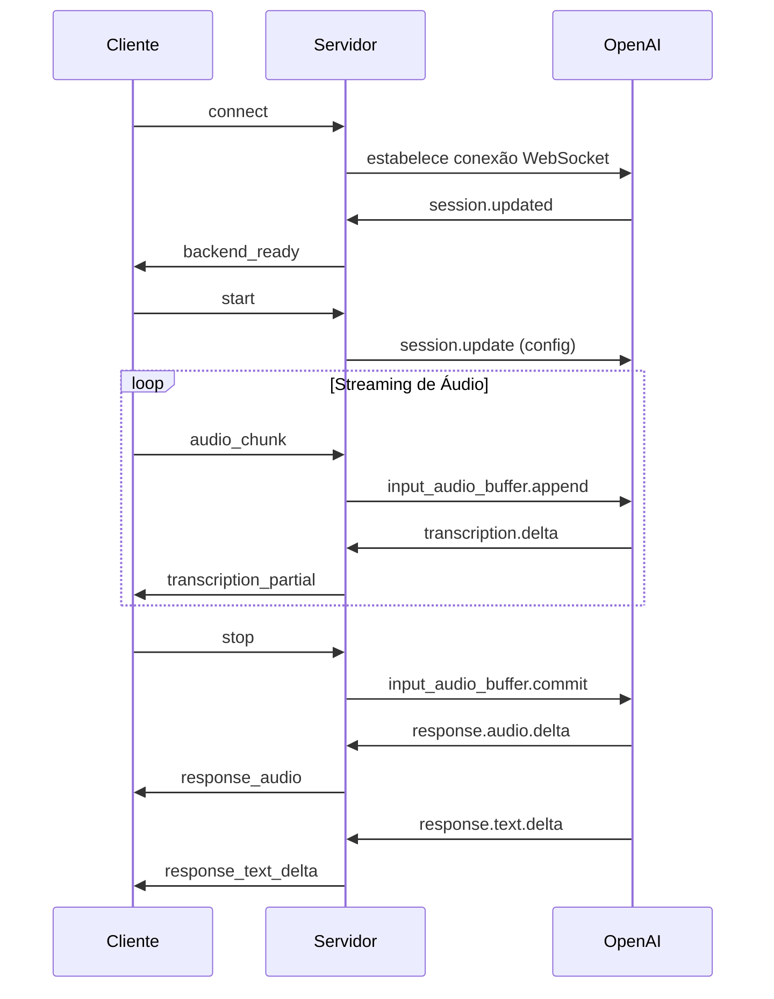

# 🎤 Audio Streaming Server

Um servidor de streaming de áudio em tempo real que integra com a API Realtime da OpenAI para transcrição e geração de respostas em áudio e texto.

## 📋 Índice

- [Visão Geral](#-visão-geral)
- [Tecnologias Utilizadas](#-tecnologias-utilizadas)
- [Pré-requisitos](#-pré-requisitos)
- [Instalação](#-instalação)
- [Configuração](#-configuração)
- [Como Usar](#-como-usar)
- [Arquitetura](#-arquitetura)
- [Eventos WebSocket](#-eventos-websocket)
- [API da OpenAI](#-api-da-openai)
- [Desenvolvimento](#-desenvolvimento)
- [Estrutura do Projeto](#-estrutura-do-projeto)

## 🎯 Visão Geral

Este projeto é um servidor backend que fornece capacidades de streaming de áudio em tempo real, utilizando WebSockets para comunicação bidirecional com clientes. O servidor atua como um intermediário entre aplicações cliente e a API Realtime da OpenAI, oferecendo:

- ✨ **Transcrição em tempo real** de áudio para texto
- 🗣️ **Geração de respostas** em áudio e texto
- 🔄 **Streaming bidirecional** de dados de áudio
- 🌐 **Interface WebSocket** para comunicação em tempo real
- 🤖 **Integração completa** com OpenAI Realtime API

## 🛠️ Tecnologias Utilizadas

- **Node.js** - Runtime JavaScript
- **TypeScript** - Linguagem principal
- **Fastify** - Framework web rápido e eficiente
- **Socket.io** - Biblioteca para WebSockets
- **WebSocket (ws)** - Cliente WebSocket para comunicação com OpenAI
- **Biome** - Linter e formatador de código

## 📋 Pré-requisitos

- Node.js (versão 18 ou superior)
- Chave de API da OpenAI com acesso à Realtime API
- npm ou yarn

## 🚀 Instalação

1. **Clone o repositório:**
```bash
git clone <url-do-repositorio>
cd audio-streaming-server
```

2. **Instale as dependências:**
```bash
npm install
```

3. **Configure as variáveis de ambiente:**
```bash
cp .env.example .env
```

## ⚙️ Configuração

### Variáveis de Ambiente

Crie um arquivo `.env` na raiz do projeto com:

```env
OPENAI_API_KEY=sua_chave_da_openai_aqui
```

### Configuração do CORS

Por padrão, o servidor aceita conexões de `http://localhost:5173`. Para modificar, edite o arquivo `src/server.ts`:

```typescript
cors: {
  origin: 'http://seu-frontend-url.com',
}
```

## 🎮 Como Usar

### Desenvolvimento

```bash
npm run dev
```

### Produção

```bash
npm start
```

O servidor iniciará na porta **3000** por padrão.

## 🏗️ Arquitetura

O projeto segue uma arquitetura modular com separação clara de responsabilidades:

```
Cliente (Frontend) ←→ Socket.io ←→ AudioStreamingServer ←→ OpenAISessionHandler ←→ OpenAI Realtime API
```

### Componentes Principais

1. **AudioStreamingServer** (`src/server.ts`)
   - Gerencia conexões WebSocket
   - Configura middleware e CORS
   - Orquestra a comunicação entre cliente e OpenAI

2. **OpenAISessionHandler** (`src/open-ai-session-handler.ts`)
   - Gerencia sessões individuais com a OpenAI
   - Processa eventos de áudio e texto
   - Mantém estado da conversa

## 🔌 Eventos WebSocket

### Eventos Ouvidos pelo Servidor

| Evento | Descrição | Payload |
|--------|-----------|---------|
| `start` | Inicia uma nova sessão com OpenAI | - |
| `audio_chunk` | Recebe chunk de áudio do cliente | `string` (dados de áudio em base64) |
| `stop` | Para o envio de áudio e finaliza entrada | - |
| `disconnect` | Cliente desconectado | - |

### Eventos Emitidos pelo Servidor

| Evento | Descrição | Payload |
|--------|-----------|---------|
| `backend_ready` | Servidor pronto para receber áudio | `{ message: string }` |
| `transcription_partial` | Transcrição parcial do áudio enviado | `string` |
| `transcription_final` | Transcrição final do áudio enviado | `string` |
| `response_transcript_partial` | Transcrição parcial da resposta da IA | `string` |
| `response_transcript_final` | Transcrição final da resposta da IA | `string` |
| `response_text_delta` | Texto parcial da resposta | `string` |
| `response_text_final` | Texto final da resposta | `string` |
| `response_audio` | Áudio da resposta da IA | `string[]` (chunks de áudio) |
| `openai_error` | Erro da API OpenAI | `unknown` |

### Fluxo de Comunicação



## 🤖 API da OpenAI

### Configuração da Sessão

O servidor configura automaticamente a sessão da OpenAI com:

- **Modalidades:** Texto e áudio
- **Idioma:** Português (forçado nas instruções)
- **Voz:** Alloy
- **Formato de entrada:** PCM16
- **Formato de saída:** G.711 μ-law
- **Detecção de turnos:** VAD (Voice Activity Detection) do servidor
- **Temperatura:** 0.8
- **Velocidade:** 1.1x

### Eventos Processados da OpenAI

- `session.updated` - Sessão configurada
- `conversation.item.input_audio_transcription.*` - Transcrição do áudio de entrada
- `response.audio_transcript.*` - Transcrição do áudio de resposta
- `response.content_part.*` - Conteúdo textual da resposta
- `response.audio.*` - Dados de áudio da resposta
- `response.done` - Resposta finalizada
- `error` - Erros da API

## 👨‍💻 Desenvolvimento

### Scripts Disponíveis

- `npm run dev` - Inicia o servidor em modo desenvolvimento com watch
- `npm start` - Inicia o servidor em modo produção

### Ferramentas de Desenvolvimento

- **TypeScript** - Tipagem estática
- **Biome** - Linting e formatação
- **Node.js experimental features** - Strip types nativo

### Estrutura de Código

O código utiliza classes e métodos bem organizados:

```typescript
// Exemplo de uso dos handlers
class OpenAISessionHandler {
  handleResponseTextDelta(content: string) {
    this.responseText += content
    this.socket.emit('response_text_delta', content)
  }
}
```

## 📁 Estrutura do Projeto

```
audio-streaming-server/
├── src/
│   ├── server.ts                    # Servidor principal
│   └── open-ai-session-handler.ts   # Handler da sessão OpenAI
├── biome.jsonc                      # Configuração do Biome
├── index.js                         # Versão legacy (Express)
├── package.json                     # Dependências e scripts
├── tsconfig.json                    # Configuração TypeScript
└── README.md                        # Este arquivo
```

### Principais Arquivos

- **`src/server.ts`** - Ponto de entrada do servidor Fastify
- **`src/open-ai-session-handler.ts`** - Lógica de integração com OpenAI
- **`index.js`** - Implementação legacy com Express (não utilizada)

## 🔧 Personalização

### Modificando a Configuração da IA

Para alterar o comportamento da IA, edite o método `createSessionConfig()` em `open-ai-session-handler.ts`:

```typescript
{
  instructions: 'Suas instruções personalizadas aqui',
  voice: 'nova-voz',
  temperature: 0.7,
  // ... outras configurações
}
```

### Adicionando Novos Eventos

1. Adicione o handler no `eventHandlers` object
2. Implemente o método correspondente
3. Emita eventos para o cliente conforme necessário

## 📝 Logs e Debugging

O servidor produz logs detalhados para debugging:

- Conexões de clientes
- Eventos da OpenAI
- Estado das transcrições
- Erros e exceções

Todos os logs são prefixados com informações contextuais para facilitar o debugging.

---

**Desenvolvido com ❤️ usando Node.js e TypeScript**
